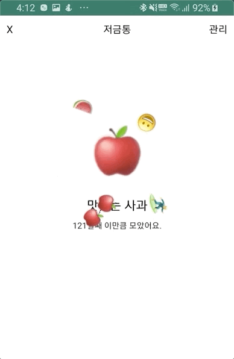
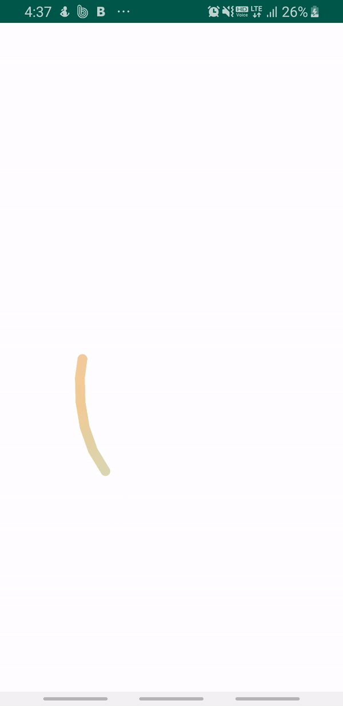
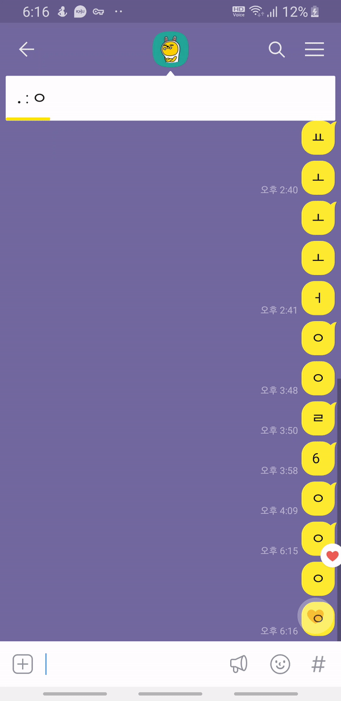

# Viewtiful
아름다운 UI 및 인터렉션을 구현하는 프로젝트입니다.

## 클론 프로젝트
- ~~카카오뱅크 저금통~~
- ~~몬스터펍 APP~~
- 삼성헬스 스트레스 체크
- 인스타그램 DM

## 카카오뱅크 저금통
### 기능 구현
- Swipelayout -> Custom view
- Emoji burst -> [Konfetti](https://github.com/DanielMartinus/Konfetti) modify
- Async -> [Rxjava](https://github.com/search?q=rxjava)

| 카카오뱅크 | 카카오뱅크 클론 |
| :---: | :---: |
| |  |

## 몬스터펍
### 기능 구현
- DrawableView -> Custom view
- Drawing -> android.graphics (Path + paint + LinearGradient)
- Async -> android.os.Handler

| 몬스터펍 | 몬스터펍 클론 |
| :---: | :---: |
| | |

## 카카오톡 하트
### 기능 구현
- HeartView -> Custom view
- Animation -> android.view.animation

| 카카오톡 하트 | 카카오톡 하트 클론 |
| :---: | :---: |
| | |